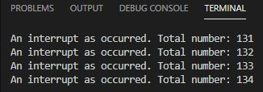

# Práctica 2b

El objetivo de la práctica és comprender el funcionamiento de las interrupciones.

Hay diferentes tipos de interrupciones:

* Evento hardware
* Un evento programado
* Llamada por software

En esta segunda parte serà una interrupcion de un evento programado.


## Código:

```
#include <Arduino.h>
 
volatile int interruptCounter;
int totalInterruptCounter;
 
hw_timer_t * timer = NULL;
portMUX_TYPE timerMux = portMUX_INITIALIZER_UNLOCKED;
 
void IRAM_ATTR onTimer() {
  portENTER_CRITICAL_ISR(&timerMux);
  interruptCounter++;
  portEXIT_CRITICAL_ISR(&timerMux);
 
}
 
void setup() {
 
  Serial.begin(115200);
 
  timer = timerBegin(0, 80, true);
  timerAttachInterrupt(timer, &onTimer, true);
  timerAlarmWrite(timer, 1000000, true);
  timerAlarmEnable(timer);
 
}
 
void loop() {
 
  if (interruptCounter > 0) {
 
    portENTER_CRITICAL(&timerMux);
    interruptCounter--;
    portEXIT_CRITICAL(&timerMux);
 
    totalInterruptCounter++;
 
    Serial.print("An interrupt as occurred. Total number: ");
    Serial.println(totalInterruptCounter);
 
  }
}

```

## Funcionamiento:

Como he dicho, es un evento programado (en este caso por timer). El propio programa hará la interrupción después de un tiempo sin necesidad de hacerlo manualmente.

És un programa que va haciendo interrupciones y las cuenta. Cuando ocurra una interrupción, por pantalla te saldrá el número de interrupciones que ha habido asi que ira sumando cada interrupcion que ocurra.


